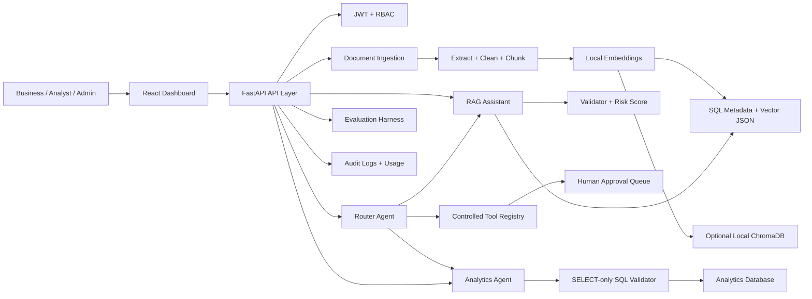

# ContextOps AI Architecture

## MVP Coverage

- Authentication and role-based access control.
- Document upload, extraction, chunking, embedding, and indexed status tracking.
- Grounded chat with citations, confidence, latency, and hallucination risk.
- Safe analytics endpoint that allows only read-only SQL with row limits.
- Prompt template management for admin users.
- Prompt-injection detection and PII masking guardrails.
- Router-style orchestration for RAG, analytics, report generation, sensitive actions, and guardrail blocking.
- Controlled tool registry with human approval for sensitive operations.
- Evaluation cases and evaluation runs with faithfulness, relevance, context, and risk metrics.
- Audit logs, usage dashboard, token/cost metrics, tool counts, pending approval counts.
- React dashboard pages for all required MVP screens.

## Extension Points

- Replace the local hashing embedder with OpenAI, Gemini, Azure OpenAI, or BGE embeddings.
- Move vector storage from SQL JSON to PostgreSQL pgvector or Qdrant.
- Replace deterministic answer composition with LangChain or LangGraph LLM calls.
- Add Celery workers for background ingestion.
- Replace local evaluation heuristics with RAGAS, DeepEval, or LangSmith evaluation pipelines.
- Use Ollama for fully local LLM generation without paid API keys.
- Use ChromaDB for local persistent vector storage without managed infrastructure.
