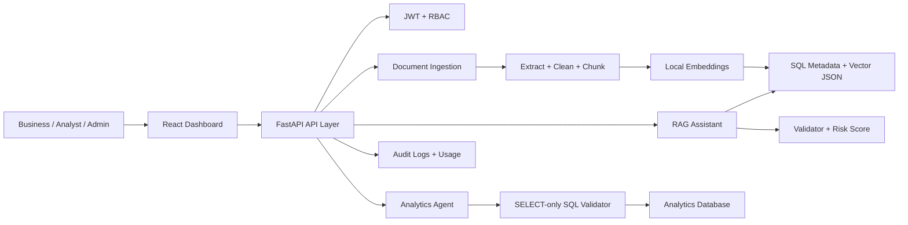

# ContextOps AI Architecture

## MVP Coverage

- Authentication and role-based access control.
- Document upload, extraction, chunking, embedding, and indexed status tracking.
- Grounded chat with citations, confidence, latency, and hallucination risk.
- Safe analytics endpoint that allows only read-only SQL with row limits.
- Prompt template management for admin users.
- Audit logs, usage dashboard, and evaluation placeholder endpoints.
- React dashboard pages for all required MVP screens.

## Extension Points

- Replace the local hashing embedder with OpenAI, Gemini, Azure OpenAI, or BGE embeddings.
- Move vector storage from SQL JSON to PostgreSQL pgvector or Qdrant.
- Replace deterministic answer composition with LangChain or LangGraph LLM calls.
- Add Celery workers for background ingestion.
- Add human approval records for ticket creation and email tools.
- Add RAGAS, DeepEval, or LangSmith evaluation pipelines.
